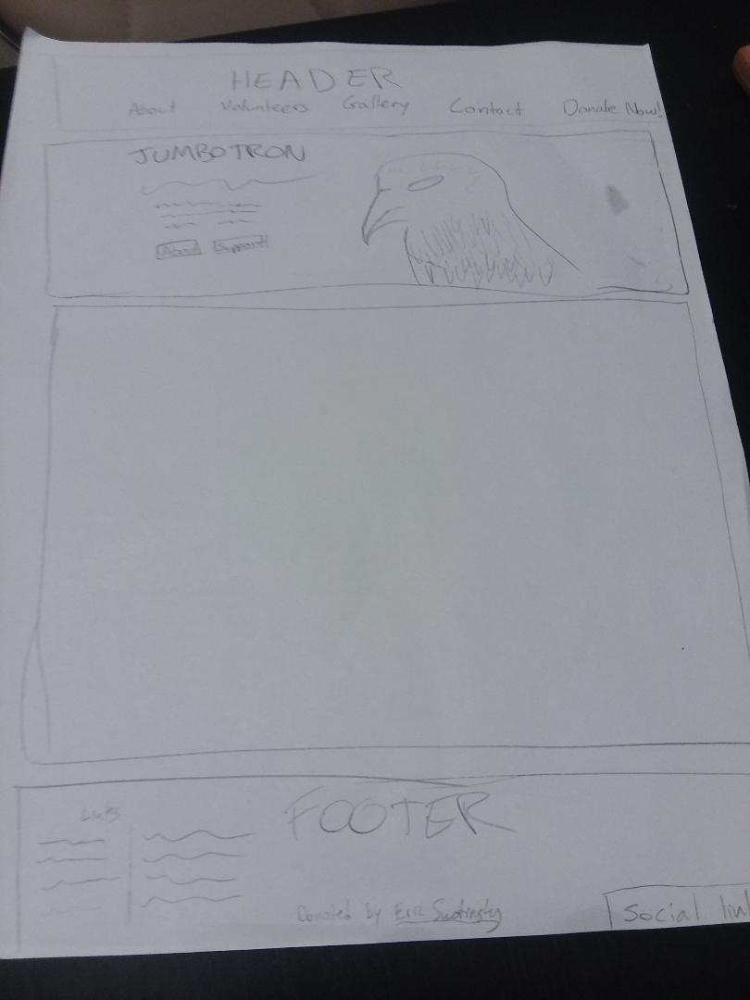
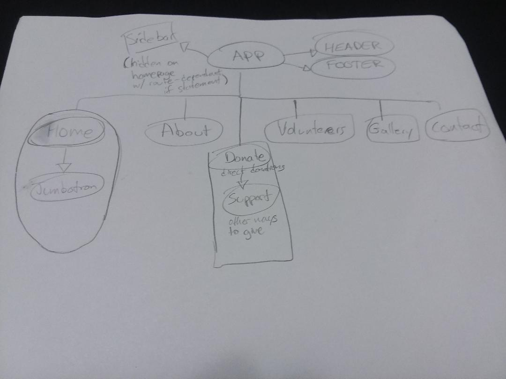

# Zazu's House Website

A React-based website for Zazu's House Parrot Sanctuary in Woodinville, WA. This site was developed as a capstone project for the C#/React track at Epicodus.

View a live demo here.

## Getting Started

These instructions will get you a copy of the project up and running on your local machine for development and testing purposes. See deployment for notes on how to deploy the project on a live system.

### Prerequisites

What things you need to install the software and how to install them

```js
Give examples
```

### Installing

A step by step series of examples that tell you have to get a development env running

Say what the step will be

```js
Give the example
```

And repeat

```js
until finished
```

End with an example of getting some data out of the system or using it for a little demo

## Deployment

Add additional notes about how to deploy this on a live system

## Built With

* [React](https://reactjs.org/) - The web framework used
* [Webpack](https://webpack.js.org/) - Dependency Management

## Authors

* **Eric Swotinsky** - [eswotinsky](https://github.com/eswotinsky)


## License

This project is licensed under the MIT License - see the [LICENSE.md](LICENSE.md) file for details

## Acknowledgments

* Hat tip to anyone who's code was used
* Inspiration
* etc

some initial mockup sketches:




